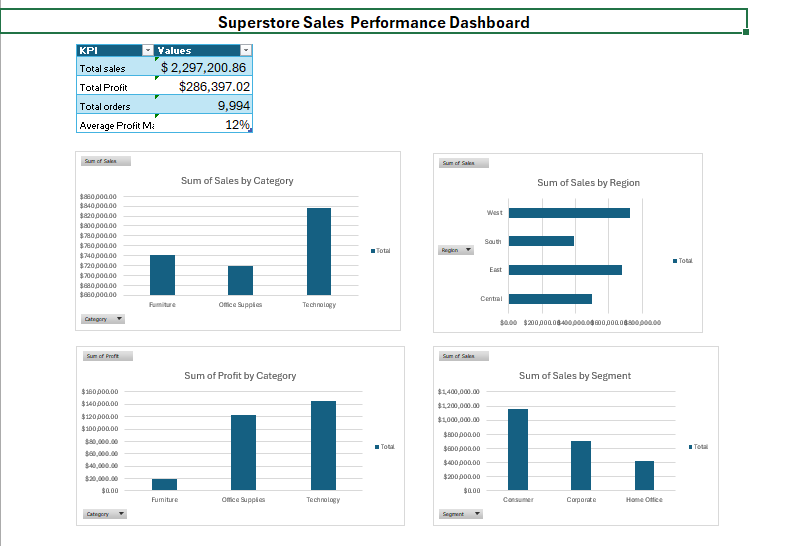

# Superstore Sales performance Dashboard(Excel)

## Project Overview

This project analyzes a Superstore sales dataset using Microsoft Excel. The goal was to clean, analyze, and visualize sales performance to identify business insights.

## Dataset 

- Rows: 9,994
- Columns: 21
- Data includes order details, customer information, product details, sales, discounts, and profit.

## Tools Used
- Microsoft Excel
- Pivot Tables
- Pivot Charts
- Excel Formulas
## Data Preparation
- Checked for missing values
- Checked and removed duplicate records
- Formatted date and numerical fields
- Created calculated metric: Profit Margin %
## Analysis Performed

- Sales analysis by category
- Sales analysis by region
- Profit analysis by category
- Sales analysis by customer segment
  
 ## Dashboard

Created an Excel dashboard containing:

- Total Sales KPI
- Total Profit KPI
- Total Orders KPI
- Average Profit Margin KPI
- Interactive Pivot Charts
  
## Key Skills Demonstrated
- Data Cleaning
- Data Analysis
- Excel Reporting
- Data Visualization
- Business Insights

## Dashboard Preview

